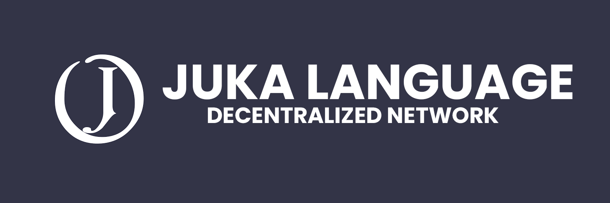

<h1 align="center">📖 Table Of Contents</h1>

- [**What is JLDN?**](#about)
- - [**What is the purpose?**](#used-for)
- - [**How does our decentralized  network work?**](#how-our-decentralized-network-works)
- [**What is a `manifest.yaml` file?**](#manifest-file)
- [**Why are installed libraries encrypted?**](#encryption)
# About

## Used For
**JLDN** is a package manager created and maintained by the Juka Language organization. It allows users to create, publish, and use libraries. *For example* if you were creating a web server, instead of recreating the whole https protocal you can install a juka library that gives you a solid framework.

## How our decentralized  network works
Our decentralized network is how JLDN is able to recieve package data. This includes the libraries contents. We pull data straight from github making it easier, and faster to recieve packages. 

# Manifest File
The `manifest.yaml` file is used to give specifications about a package. This includes the current version, description, and content. 

# Encryption 
We use a encrypted solution when you install packages from **JLDN**. Since Juka's primary target is runtime speed encryption is the fastest way of the Juka runtime to execute.